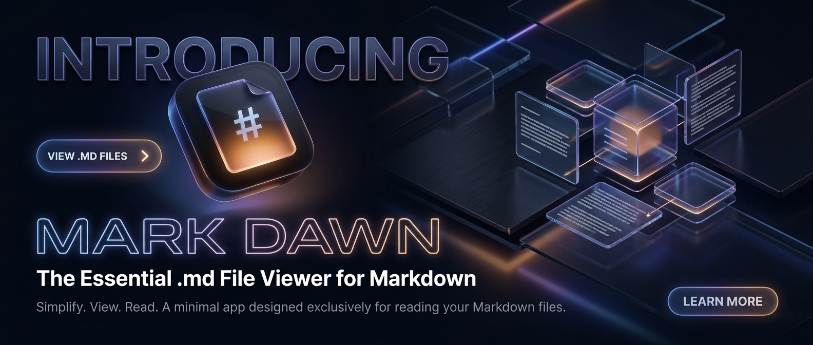
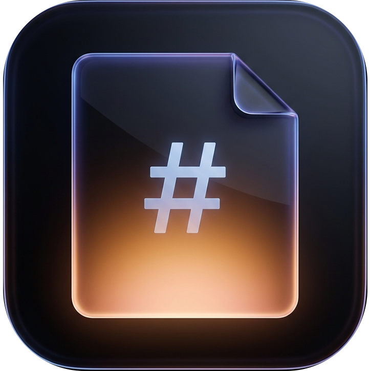

# mark-dawn

> I always hated opening markdown files in VS Code or Cursor or whatever bloated editor just to read a `.md` file. Like, why do I need a whole IDE for that? So I tried to build a separate app that respects us more when it comes to these `.md` files.
>
> It was made by me (a guy who doesn't fully know what he's doing) and AI. This is pure AI slop-sluppy-shit-show and I'm sorry for the app, but it works for me so maybe it works for you too.
>
> Give it a try. Or don't. Probably better not to look at the code. If it works, let it work. If it doesn't, report it to Claude Code or something, idk, that's how I do it. Sorry again for the app.

---

## What is this thing?

**mark-dawn** is a fast, minimal Markdown editor and viewer for Windows. Split-pane, live preview, dark/light theme, RTL support, the whole deal. It opens `.md` files and makes them look nice. That's it. That's the app.

<p align="center">
  
</p>

## Features

- **Split-pane editor** — write on the left, see the rendered result on the right
- **Live preview** — updates as you type (with a small debounce so your CPU doesn't cry)
- **Dark & Light themes** — toggle from the toolbar, follows your system theme by default
- **RTL support** — full right-to-left text support for Farsi, Arabic, Hebrew, etc.
- **Scroll sync** — editor and preview scroll together, with a button to unlink them if you want
- **System fonts** — pick any font installed on your system, not just the usual suspects
- **Adjustable font size** — from 10px to 32px, your eyes will thank you
- **Syntax highlighting** — in the editor, because raw markdown deserves colors too
- **Word wrap & line numbers** — toggleable from the View menu
- **Toolbar** — bold, italic, headings, links, images, code blocks, tables, lists, quotes, horizontal rules
- **Keyboard shortcuts** — Ctrl+S, Ctrl+O, Ctrl+N, Ctrl+Z, Ctrl+Y, Ctrl+F... you know the drill
- **Drag & drop** — drop a `.md` file on the window and it opens
- **File association** — installer registers itself as the default app for `.md` files
- **Focus mode** — F11 for distraction-free writing
- **Word count & cursor position** — in the status bar, because why not

## Installation

### Download the installer

Grab the latest `mark-dawn Setup X.X.X.exe` from the [Releases](../../releases) page and run it. That's it. It will:

- Install mark-dawn on your system
- Set itself as the default app for `.md` and `.markdown` files
- Add the app icon to all your markdown files in Explorer

### Build from source

If you're brave enough to look at the code (I warned you):

```bash
git clone https://github.com/mathofdynamic/mark-dawn.git
cd mark-dawn
npm install
npm run dev       # run in development mode
npm run dist      # build the installer
```

## Tech Stack

Because someone will ask:

| Layer | Technology |
|-------|-----------|
| Shell | Electron |
| UI | React 18 |
| Editor | CodeMirror 6 |
| Markdown | marked (GFM) |
| Build | Vite + vite-plugin-electron |
| Installer | electron-builder (NSIS) |
| Language | TypeScript |
| Styling | Pure CSS (no frameworks, we're not animals) |

## Screenshots

*Coming soon, or just install it and see for yourself.*

## Contributing

Look, I'm not going to pretend this is a serious open-source project with contribution guidelines and a code of conduct. If you want to fix something, open a PR. If you want to add something, open a PR. If you want to tell me the code is bad, I already know, but open an issue anyway.

## License

MIT License. Do whatever you want with it. I'm not responsible for anything.

---

<p align="center">
  <sub>Built with questionable decisions, mass amounts of AI, and an unreasonable hatred for opening VS Code just to read a README.</sub>
</p>
